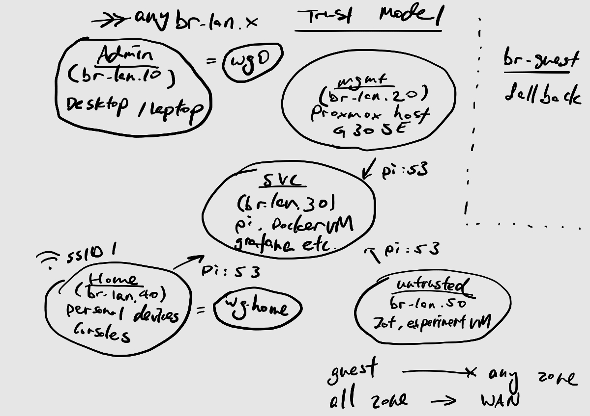

# Homelab

A segmented home network and virtualisation lab, built and documented as it was learned.
No configuration files, keys or secrets are committed.

## Hardware

| Device           | Role                                 | Description                                  |
| ---------------- | ------------------------------------ | -------------------------------------------- |
| Asus RT-AX52     | Router, firewall, inter-VLAN routing | MediaTek MT7981 (Filogic), OpenWRT, nftables |
| Netgear GS305E   | 5-port managed switch                | 802.1Q tagging, smart-managed-plus           |
| Intel NUC        | Virtualisation host                  | i3-1115G4, 32GB DDR4-3200, 500GB M.2         |
| Raspberry Pi 3B+ | DNS                                  | Pi-hole, Unbound                             |
| Desktop / laptop | Admin                                | VLAN 10, wg0 when remote                     |

WAN is a static public IP delivered by ISP DHCP reservation. This allow no CGNAT and a single inbound endpoint I control, on hardware I own, rather than a third-party relay like Tailscale sitting in the path.
## Trust model

The design assumes the most likely compromise is an internet-facing service or a
device I don't control, so each zone is sized to be the blast radius of those devices.

Zone policy is default-deny, every zone rejects input and forward, and traffic
rules open single ports to single hosts as explicit exceptions. `wan` is set to drop rather than reject so it doesn't answer scans.

| From \ To   | admin | mgmt | svc | home | untrusted | guest | wan |
| ----------- | ----- | ---- | --- | ---- | --------- | ----- | --- |
| `admin`     | no    | yes  | yes | yes  | yes       | no    | yes |
| `mgmt`      | no    | no   | :53 | no   | no        | no    | yes |
| `svc`       | no    | no   | :53 | no   | no        | no    | yes |
| `home`      | no    | no   | :53 | no   | no        | no    | yes |
| `untrusted` | no    | no   | :53 | no   | no        | no    | yes |
| `guest`     | no    | no   | no  | no   | no        | no    | yes |

Defaults are input DROP, forward REJECT. `admin` is the only zone with input
ACCEPT, which is what makes it the management segment — every other zone rejects
or drops packets addressed to the router itself. `untrusted` drops rather than
rejects, so a compromised device there gets no response at all.

No zone forwards to `svc`. The port 53 exceptions are traffic rules, which
override zone forwardings.

WireGuard peers inherit the zone they land in rather than getting their own:
wg0 is in `admin`, wg1 (`wghome`) in `home`.

DNS needs 4 traffic rules, one per zone, each scoped to a single destination address and port `192.168.30.35:53`, including the `svc` zone. Because every zone also rejects intra-zone forwarding, `svc` needs a rule to reach its own resolver, so a second host on that segment can resolve.

- **`admin`** is the only zone that reaches everything in br-lan, and the only zone the
  router's own management services listen on, dropbear bound to `admin`, LuCI
  bound to specific addresses rather than all interfaces.
- **`mgmt`** holds the things that can reconfigure the network — Proxmox host, the
  switch, the automation LXC. Nothing may enter it except from `admin`, so
  compromising a media box or a console gains no path to the hypervisor.
- **`svc`** is the one zone every other zone needs, which is why it is the one
  zone reachable across boundaries currently on port 53 only, to a single host, the pi.
- **`home`** and **`untrusted`** get DNS and internet and that's it. They are
  separated from each other.

The switch is a smart managed plus model and does not properly isolate its own
management plane, so isolation has to be enforced at the router: the switch has a
static address on `mgmt` and is unreachable from any zone that cannot route
there. Although this fails at layer 2, hence a mgmt vlan.

## VLANs

### br-lan

| VLAN | Zone        | Subnet          | Now                                  | Planned                                             |
| ---: | ----------- | --------------- | ------------------------------------ | --------------------------------------------------- |
|   10 | `admin`     | 192.168.10.0/24 | Desktop, laptop, wg0                 | —                                                   |
|   20 | `mgmt`      | 192.168.20.0/24 | Proxmox host, switch, automation LXC | Uptime Kuma                                         |
|   30 | `svc`       | 192.168.30.0/24 | Pi (Pi-hole, Unbound), printer       | Docker VM (Jellyfin, Grafana, Loki), Remote baregit |
|   40 | `home`      | 192.168.40.0/24 | Personal devices, consoles, wg1      | —                                                   |
|   50 | `untrusted` | 192.168.50.0/24 | IoT, experimental VM                 | game server VMs                                     |

VLAN 1 and the original `192.168.123.0/24` flat network were retired.

### br-guest

A flat network only using point, with a weak SSID for fallback and convenience, deny incoming, allow outgoing, uses `6,94.140.14.14,94.140.15.15` adguard DNS upstream resolver. No path to br-lan.

## Physical layout

- Router → switch, trunk carrying all VLANs tagged
- p2 Raspberry Pi, untagged 30
- p3 Intel NUC, untagged 20 with 30 and 50 tagged — Proxmox guests take their VLAN from the bridge
- p4 Desktop, untagged 10
- p5 Laptop, untagged 10
- WiFi: SSID 1 → home, SSID 2 → guest